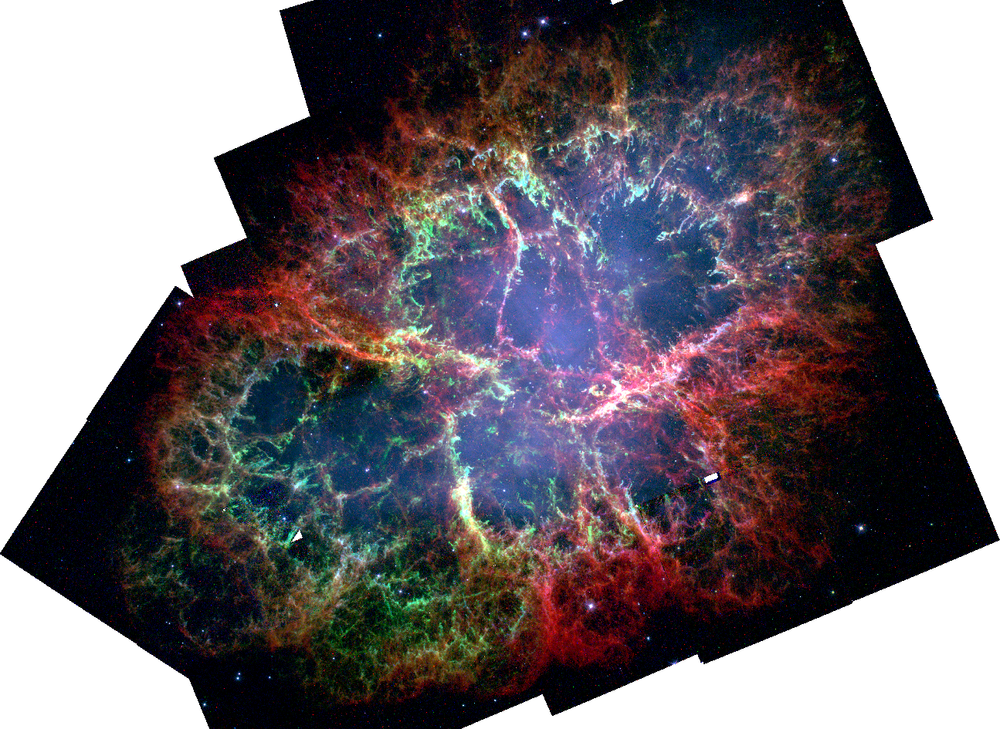

##########################################
Data Buttons: Quick Mosaics for You and Me
##########################################

============
Introduction
============

``data_buttons`` offers a number of tools to query archives, download image data for a given source and mosaic it into a
final image.

The biggest feature of this module is the Data Button\ :sup:`TM`\, which allows you an easy way to put in an object (and
optionally an image size), and get a mosaic out. No muss, no fuss.

============
Installation
============

* Clone the ``data_buttons`` repository with ``git clone https://github.com/thomaswilliamsastro/data_buttons`` into a
  folder of your choice

* Navigate to the directory that contains ``setup.py``

* Install using ``pip install -r requirements.txt -e .``

====================
Current capabilities
====================

``data_buttons`` currently works with GALEX (``data_buttons.galex``), 
SDSS (``data_buttons.sdss``), 2MASS (``data_buttons.two_mass``),
WISE (``data_buttons.wise``), HST (``data_buttons.hst``), Spizter (``data_buttons.spitzer``),
Herschel (``data_buttons.herschel``), and Planck (``data_buttons.planck``)
data. More telescopes and data coming soon!

.. warning::
    I am not well-versed in HST data, and that module should be considered
    in its infancy. Your mileage may vary, so be aware!

``data_buttons`` also offers a module with image-related tools 
(``data_buttons.tools``). Currently, this allows you to create a mosaic
of pre-downloaded files, without going through the whole Data Button.
It also offers a tool to calculate the sigma-clipped background median
of an image (for subtracting off a constant background), or a slightly
fancier polynomial fitting tool. More useful tools coming soon!

=======================================
Example: Creating a GALEX Mosaic of M51
=======================================

Using the Data Button\ :sup:`TM`\, we'll create a GALEX mosaic of the classic poster child galaxy, M51.

.. code-block:: python

    import os
    from data_button import galex

    os.chdir('directory')
    galex.galex_button('M51')

And that's all there is to it! The program will query the necessary databases, download the data and mosaic it for you.
It'll put the final files (in this case, M51/GALEX/M51_NUV.fits and M51/GALEX/M51_FUV.fits), into the directory you specify 
in the ``os.chdir()`` call.

================================================
Advanced Example: HST Imaging of the Crab Nebula
================================================

As a more involved example, we'll create a 3-colour mosaic of WFPC2 observations
of the Crab Nebula (M1). This will involve the (slightly more) involved
HST button.

The WFPC2 observations we'll use come from proposal ID 8222 (PI J. Hester).
Because the Crab has a lot of archival HST observations, we'll just pare down 
to this particular proposal on this particular instrument.

.. code-block:: python

    import os
    from data_button import hst, tools

    os.chdir('directory')
    
    galaxy = 'M1'
    prop_id = '8222'
    instrument = 'WFPC2/WFC'
    
    # Create the mosaics of M1.
    
    hst.hst_button(galaxy,
                   instruments=instrument,
                   prop_ids=prop_id,
                   skymethod='globalmin',
                   verbose=True,
                   )
	               
Generally, I've found the default skymethod in the button ('globalmin+match')
to be fine, but since these observations have very little overlap it causes
weird issues with the background matching, so we'll perform our own 
subtraction later. This will put mosaicked files into M1/HST/8222.

We'll now optimize the size of these files for later work. In some cases,
this can cut the file size down by a factor of 2, so it's worth doing!
Since there's only a single observation per field for the continuum, 
the HST button won't have done any cosmic ray masking so we'll not use 
this, but it leaves us with 3 narrow band filters (perfect for a 3-colour
mosaic!). We'll then perform a median background subtraction to get rid
of any remaining background issues.

.. code-block:: python

	# Optimize the size for the narrow filters, and perform a median 
	# background subtraction.

	filters = ['F502N', 'F631N', 'F673N']
	folder = galaxy+'/HST/'+prop_id+'/'
	instrument = instrument.replace('/','_')
	
	for hst_filter in filters:
	    
	    filename = folder+galaxy+'_'+instrument+'_'+hst_filter+'_'+prop_id
	    
	    hdu_trimmed = tools.optimize_size(filename+'.fits')
	    
	    # Subtract background median.
	    
	    hdu_trimmed.data -= tools.background_median(hdu_trimmed)
	    
	    hdu_trimmed.writeto(filename+'_trim.fits',
	                        overwrite=True)

The final, trimmed and background subtracted files will be in the same
folder as the original mosaics. Playing around a bit in DS9 we can make
a nice looking picture.

 